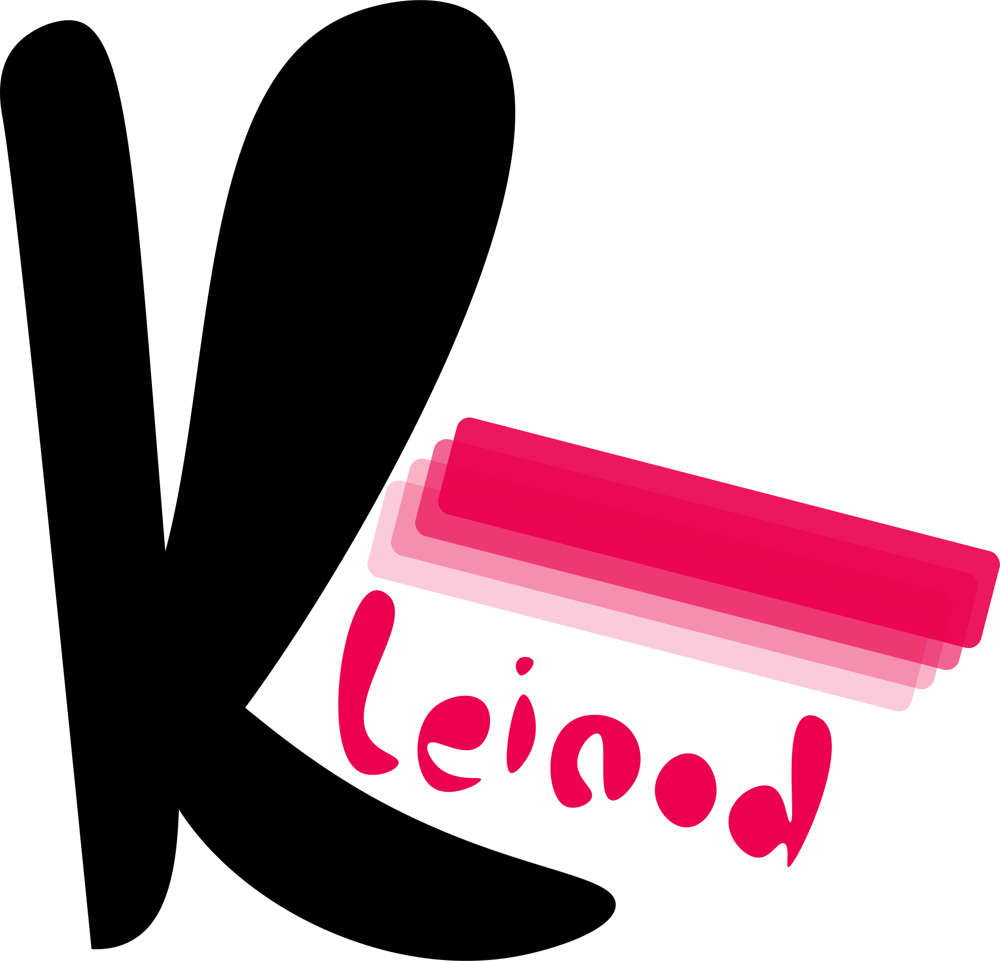

  

<h1 align="center">Kleinod</h1>
<h2 align="left">What's so special about it?</h2>
It is supposed to be lightweight, easy to use and especially useful for layered sidescrolleres. (Like some levels in <a href="https://www.nintendo.at/Spiele/Nintendo-Switch-Spiele/Super-Mario-Bros-Wonder-2404150.html">Mario Wonder</a>, where the level has some depth that the player can explore but remains a sidescroller in essence)

<h2 align="left">What's the point of this project?</h2>
I started Kleinod because i wanted to get to know the inner workings of game engines in lower level languages. Explicitly:
  
- I want to properly learn C++.
- I kind of like game dev.
- This is a fun side project made for myself =)
